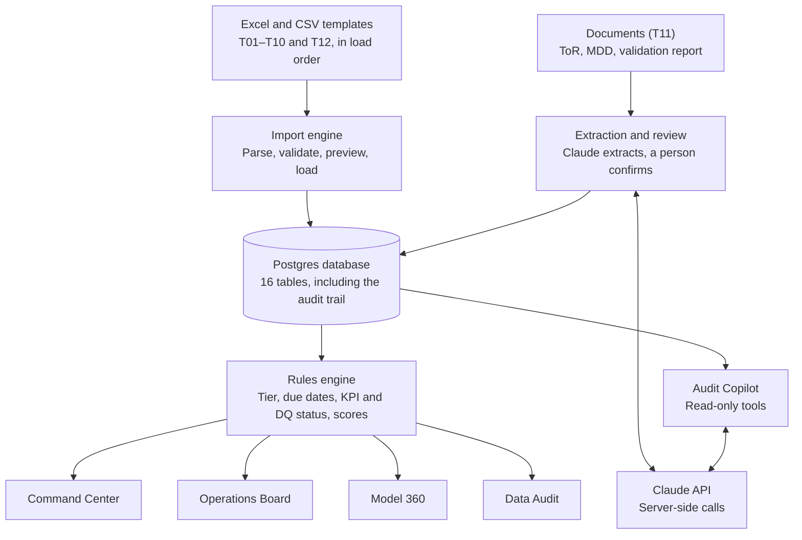
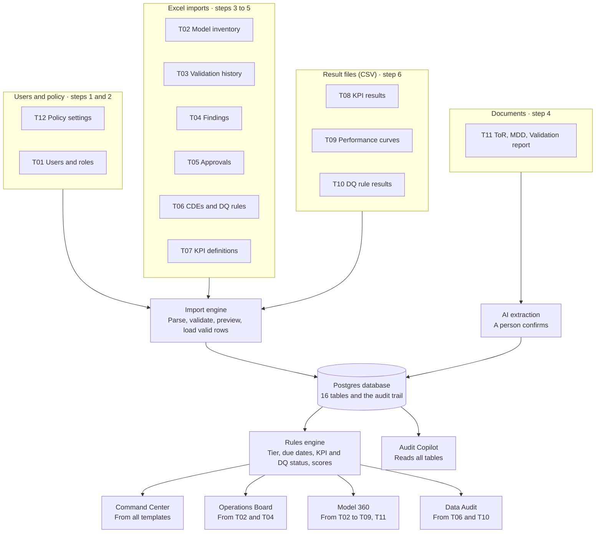

# Model Governance MIS — Initial Build Requirements and Design

Sep 29, 2026 · Anand Iyer

Exported from the shared document for use as `docs/design.md` in the Claude Code repository. Input template specifications are in `docs/templates.md`.

## 1. Purpose and scope

The initial build turns the Model Governance MIS prototype into a working web application that is loaded entirely from input templates and shown to a customer as a live demonstration. Every number on every screen is calculated from loaded records; nothing on a screen is hard-coded.

The build covers the one-time onboarding of a model inventory, in seven steps:

1. Configure policy (tiering rules, SLAs, revalidation frequencies, score weights, required documents).
2. Load users and roles.
3. Load the model inventory, with risk tiering.
4. Load history: validations, findings, approvals, and key documents.
5. Register critical data elements (CDEs) and KPI thresholds.
6. Load an initial set of KPI, backtesting, performance-curve and data quality results.
7. Calculate governance scores and display the dashboards and Audit Copilot.

**In scope:** the seven steps above; Excel and CSV imports with row-level validation; add and edit forms for models; document upload with AI extraction and human confirmation; Command Center, Operations Board, Model 360, Data Audit, Import Center and Admin screens; a grounded Audit Copilot; an audit trail of every load and edit; a reset-to-seed action.

**Out of scope (maintenance, a later phase):** scheduled feeds and APIs; automatic phase changes from new results after the initial load; a simulated calendar; revalidation, MRC and retirement workflows; MRC transcript extraction; regulatory request intake; notifications; single sign-on; GRC system integration.

The **Input templates** tab holds every template, column by column, with sample rows.

## 2. Requirements

The initial build has 52 requirements: 45 Must and 7 Should. Template IDs (T01–T12) refer to the Input templates tab.

| ID | Area | Requirement | Priority | Acceptance criteria |
| --- | --- | --- | --- | --- |
| REQ-IMP-01 | Import framework | Import Excel (.xlsx) and CSV files against a named template (T01–T10, T12) | Must | User picks a template, uploads a file, and sees a preview before anything is saved |
| REQ-IMP-02 | Import framework | Validate every row: required fields, data types, allowed values, ISO dates, unique keys, references to existing records | Must | Each failing row lists its row number, column and reason |
| REQ-IMP-03 | Import framework | Load valid rows and skip rejected rows, with a downloadable error report | Must | Loaded and rejected counts shown; error report downloads as CSV |
| REQ-IMP-04 | Import framework | Enforce load order: T12 → T01 → T02 → T03–T05 → T06–T07 → T08–T10 | Must | A template whose prerequisite is not loaded is disabled, with the reason shown |
| REQ-IMP-05 | Import framework | Re-importing a row with an existing key updates that record | Should | Re-import of a changed row updates it and logs the change |
| REQ-IMP-06 | Import framework | Provide a blank download of every template with a header row and an instructions sheet | Must | Each template downloads from the Import Center |
| REQ-CFG-01 | Policy | Load policy settings from T12 and edit them in Admin | Must | Tier thresholds, SLA days, frequencies, lead time, score weights and required documents are editable |
| REQ-CFG-02 | Policy | Recalculate derived values when policy changes | Must | Changing a score weight updates every score and the portfolio average |
| REQ-USR-01 | Users | Load users and roles from T01 | Must | Roles: Admin, Model Owner, Model Developer, Validator, MRC Member, Auditor, Executive |
| REQ-USR-02 | Users | Header role switcher for the demo, with no sign-in | Must | Switching role changes the actions available on each screen |
| REQ-USR-03 | Users | Restrict actions by role | Must | Only Admin imports templates and edits policy; Validator and Model Owner may upload documents; Auditor and Executive are read-only |
| REQ-INV-01 | Inventory | Load the model inventory from T02 | Must | 256 seed models load with no errors |
| REQ-INV-02 | Inventory | Add and edit a single model through a form | Must | New model appears on every screen immediately |
| REQ-INV-03 | Inventory | Block a validator who is also the owner or developer of the same model | Must | Save is refused with a segregation-of-duties message, in form and import |
| REQ-INV-04 | Inventory | Record revalidation frequency and last validation date, and calculate the next due date | Must | Due date = last validation date + frequency in months |
| REQ-INV-05 | Inventory | Link a retired model to its successor | Should | Model 360 of a retired model shows its successor |
| REQ-TIR-01 | Tiering | Calculate risk tier from four tiering answers | Must | Tier follows the score bands in section 7 |
| REQ-TIR-02 | Tiering | Allow an Admin to override the tier with a justification | Should | Override and justification are shown on Model 360 and in the audit trail |
| REQ-HIS-01 | History | Load validation history from T03 | Must | Each model shows its validation dates and outcomes |
| REQ-HIS-02 | History | Load findings from T04 | Must | Open findings by severity match the file |
| REQ-HIS-03 | History | Load approvals and MRC decisions, with conditions, from T05 | Must | Model 360 lists every decision, newest first |
| REQ-DOC-01 | Documents | Upload PDF or DOCX documents of type ToR, MDD or Validation report (T11) | Must | Document stored against the model with type, version and uploader |
| REQ-DOC-02 | Documents | Extract structured fields from an uploaded document with Claude | Must | Validation report produces candidate findings; MDD produces a section checklist |
| REQ-DOC-03 | Documents | Hold extracted content for review until a user confirms it | Must | Nothing is saved to findings until confirmed; user can edit or drop each item |
| REQ-DOC-04 | Documents | Check an MDD against the required sections in policy | Must | Missing sections are listed and lower the documentation score |
| REQ-CDE-01 | Data audit | Load CDEs from T06, one row per source system, table and column | Must | Each CDE shows its source system, table and column |
| REQ-CDE-02 | Data audit | Load DQ rule results from T10 and set each CDE to Pass, Warn or Fail | Must | Status follows the thresholds in section 7 |
| REQ-CDE-03 | Data audit | Create a DQ issue for each failing CDE at load | Must | One open issue per failing CDE and rule, with no duplicates |
| REQ-KPI-01 | Monitoring | Load KPI definitions and thresholds from T07 | Must | Each KPI has a direction, threshold and warning band |
| REQ-KPI-02 | Monitoring | Load KPI and backtesting results from T08 and set Pass, Warn or Fail | Must | Status follows the rule in section 7 |
| REQ-KPI-03 | Monitoring | Load ROC and predicted-versus-actual curves from T09 | Must | Model 360 draws the curve; ROC shows AUC |
| REQ-SCR-01 | Scoring | Calculate a governance score per model from five weighted components | Must | Score and component breakdown shown on Model 360 |
| REQ-SCR-02 | Scoring | Calculate the portfolio score as the average of non-retired models | Must | Command Center tile equals the average |
| REQ-CC-01 | Command Center | Show KPI tiles: total models, in production, high risk, revalidation queue, open findings, portfolio score | Must | Each tile matches a database count |
| REQ-CC-02 | Command Center | Show charts: risk tier, model type, phase distribution, revalidation timeline, Reg/Audit issues, DQ health | Must | Each chart shows counts and percentages |
| REQ-CC-03 | Command Center | Every tile and chart segment opens the Operations Board with that filter applied | Should | Clicking “High” shows only high-risk models |
| REQ-CC-04 | Command Center | Show generated governance insights from rules, not a fixed list | Should | Insights reflect loaded data, such as an independence breach or overdue revalidation |
| REQ-OPS-01 | Operations Board | Show an 8-column pipeline: Initiation, Development, Validation, Implementation, Monitoring, Revalidation, Reg/Audit, Retirement | Must | Revalidation column is derived as in section 7 |
| REQ-OPS-02 | Operations Board | Filter by model type, risk tier, phase and business line | Must | Pipeline and table update together |
| REQ-OPS-03 | Operations Board | Inventory table with sort, search and CSV export | Must | Export contains the filtered rows |
| REQ-M360-01 | Model 360 | Show profile, lifecycle stepper, tier, owners and revalidation countdown | Must | Countdown shows days overdue or days remaining |
| REQ-M360-02 | Model 360 | Show KPIs, backtesting history, performance curve, findings, approvals, documents, CDEs and score breakdown | Must | Each panel shows an empty state when no data exists |
| REQ-DA-01 | Data Audit | CDE registry across all models, filterable by model and status | Must | Filters work together |
| REQ-DA-02 | Data Audit | DQ issue log with severity, detected date, status and impact | Must | Sorted newest first |
| REQ-COP-01 | Audit Copilot | Answer plain-language questions from the database through read-only tools | Must | Every answer cites the model IDs it used |
| REQ-COP-02 | Audit Copilot | Say when the data does not answer the question | Must | No invented figures when a tool returns nothing |
| REQ-COP-03 | Audit Copilot | Offer suggested questions | Should | Chips run the question when clicked |
| REQ-AUD-01 | Audit trail | Record every import, edit, confirmation and policy change with user, role and timestamp | Must | Audit screen lists entries, filterable by model |
| REQ-GEN-01 | Demo | Reset all data to the seed with one Admin action | Must | Reset completes in under 30 seconds |
| REQ-GEN-02 | Demo | Ship sample upload files for the demo script, including one file with deliberate errors | Must | Files sit in the repository and are listed in the demo script |
| REQ-NFR-01 | Non-functional | Pages load in under 2 seconds with 256 models | Should | Measured on the deployed demo |
| REQ-NFR-02 | Non-functional | Use synthetic data only; no customer data | Must | Seed and sample files are generated, not copied |

## 3. Solution architecture

The initial build is one Next.js application on Vercel with a Postgres database; files enter only through the import engine or document review, and screens and the copilot only read.



*Figure: initial build architecture, templates to screens.*

The database is the single record: screens never compute from files directly, and every change passes through a service that writes an audit event.

| Layer | Choice | Reason |
| --- | --- | --- |
| Web application | Next.js (App Router), TypeScript | One codebase for screens and server routes; the API key stays on the server |
| Database | Postgres (Neon) with Prisma | Relational model in section 4; migrations and a typed client |
| Document storage | Vercel Blob | Holds uploaded PDF and DOCX files |
| Import parsing and validation | SheetJS, PapaParse, zod | Reads .xlsx and .csv; one zod schema per template |
| Document text | pdf-parse, mammoth | Text from PDF and DOCX before extraction |
| Charts | Recharts | Donuts, bars, ROC and predicted-versus-actual lines |
| AI | Anthropic SDK (Claude) | Copilot tool use and document extraction |
| Tests | Vitest, Playwright | Rule unit tests; end-to-end demo script |
| Hosting | Vercel | Preview URL per branch; production URL for the demo |

## 4. Data model

Sixteen tables hold everything; each import template writes to one table, except T02 (model and tiering_answer) and T06 (cde and dq_rule), and derived values (tier, due date, KPI status, scores) are calculated, never imported. Column names in the templates tab match these field names, in snake_case.

| Table | Key fields | Relationships | Written by |
| --- | --- | --- | --- |
| policy_setting | setting_key (PK), value, value_type, description | None | T12, Admin screen |
| app_user | user_id (PK), full_name, email, role, business_line, active | Referenced by model, finding, approval, cde, audit_event | T01 |
| model | model_id (PK), model_name, model_type, model_subtype, purpose, business_line, owner_id, developer_id, validator_id, lifecycle_phase, status, version, go_live_date, revalidation_frequency, last_validation_date, successor_model_id | Owner, developer and validator → app_user; successor → model | T02, model form |
| tiering_answer | model_id (PK, FK), q_materiality, q_complexity, q_reliance, q_regulatory_use, override_tier, override_reason | One per model | T02, model form |
| validation | validation_id (PK), model_id, validation_type, validator_id, start_date, completion_date, outcome, report_document_id | model; app_user; document | T03 |
| finding | finding_id (PK), model_id, validation_id, title, description, severity, category, status, owner_id, raised_date, due_date, closed_date, source | model; validation; app_user | T04, document confirmation |
| approval | approval_id (PK), model_id, decision_date, forum, decision_type, decision, conditions, condition_due_date, condition_status | model | T05 |
| document | document_id (PK), model_id, doc_type, version, file_name, storage_path, uploaded_by, uploaded_at, extraction_status, extracted_json, confirmed_by, confirmed_at | model; app_user | T11 upload |
| cde | cde_id (PK), model_id, cde_name, source_system, source_table, source_column, data_owner_id | model; app_user | T06 |
| dq_rule | dq_rule_id (PK), cde_id, rule_description, pass_threshold_pct, warn_threshold_pct | cde | T06 |
| dq_result | run_id + dq_rule_id (PK), run_date, records_tested, records_failed | dq_rule | T10 |
| dq_issue | dq_issue_id (PK), cde_id, dq_rule_id, run_id, description, severity, detected_date, status, business_impact | cde; dq_rule; dq_result | Created at T10 load |
| kpi | kpi_id (PK), model_id, kpi_name, direction, threshold, warn_tolerance_pct, frequency | model | T07 |
| kpi_result | model_id + kpi_id + period (PK), value, is_backtest | kpi | T08 |
| performance_point | model_id + curve_type + period + series + point_index (PK), x, y, auc | model | T09 |
| audit_event | event_id (PK), occurred_at, user_id, role, action, entity, entity_id, before_json, after_json, import_batch_id | app_user | Every write |

Allowed values are fixed lists held in code: model_type (Credit Risk, Provisioning, Balance Sheet, Forecasting, CCAR/Stress Testing), lifecycle_phase (Initiation, Development, Validation, Implementation, Monitoring, Reg/Audit, Retirement), severity (Critical, Medium, Low), finding status (Open, In Progress, Closed), decision (Approved, Conditional, Rejected), revalidation_frequency (Monthly, Quarterly, Semi-annual, Annual, Biennial). Revalidation is not a stored phase; section 7 derives it.

## 5. Input templates

Twelve templates feed the initial build: eight Excel, three CSV and one document upload. Column-level specifications and sample rows are in the Input templates tab.



*Figure: end-to-end flow, showing which template enters where.*

Spreadsheets and CSV files pass through the import engine's row checks; documents pass through AI extraction and a person's confirmation. Only then do they reach the database, and every screen reads from there.

| ID | Template | Format | Onboarding step | Target table | Demo use |
| --- | --- | --- | --- | --- | --- |
| T12 | Policy settings | Excel | 1 | policy_setting | Seeded; one weight changed live |
| T01 | Users and roles | Excel | 2 | app_user | Seeded |
| T02 | Model inventory and tiering | Excel | 3 | model, tiering_answer | Seeded (256); 5-row file imported live with 1 bad row |
| T03 | Validation history | Excel | 4 | validation | Seeded |
| T04 | Findings | Excel | 4 | finding | Seeded |
| T05 | Approvals and MRC decisions | Excel | 4 | approval | Seeded |
| T11 | Documents (ToR, MDD, Validation report) | PDF or DOCX upload | 4 | document, then finding on confirmation | Validation report and an incomplete MDD uploaded live |
| T06 | Critical data elements and DQ rules | Excel | 5 | cde, dq_rule | Seeded; one CDE added live |
| T07 | KPI definitions and thresholds | Excel | 5 | kpi | Seeded |
| T08 | KPI and backtesting results | CSV | 6 | kpi_result | Seeded |
| T09 | Performance curves | CSV | 6 | performance_point | Seeded |
| T10 | DQ rule results | CSV | 6 | dq_result, dq_issue | Seeded; one results file loaded live to open DQ issues |

The seed generator writes the full seed as these same files, so the database is always rebuilt through the import path the demo shows.

Full specifications: `docs/templates.md` (the Input templates tab of the shared document).

## 6. Screens and navigation

Seven screens sit under one header with the role switcher and a Copilot toggle; the visual design carries over from the current HTML prototype (dark theme, flat cards with thin borders, no drop shadows).

| Route | Screen | Contents | Roles that can act |
| --- | --- | --- | --- |
| / | Command Center | KPI tiles; risk tier and model type donuts with percentage tiles; phase distribution; revalidation timeline; Reg/Audit open issues by severity; DQ health; generated insights; action panels | View: all |
| /operations | Operations Board | Filter bar (type, tier, phase, business line, search); 8-column pipeline of model cards; inventory table with sort and CSV export | View: all |
| `/models/[id]` | Model 360 | Header with tier, phase, score ring and revalidation countdown; owners; lifecycle stepper; KPI table; backtesting grid; performance curve; findings; approvals; documents; CDEs; score breakdown | Edit model: Admin, Model Owner |
| `/models/new`, `/models/[id]/edit` | Model form | All T02 fields; tiering questionnaire with live tier preview; segregation-of-duties check on save | Admin, Model Owner |
| /data-audit | Data Audit | CDE registry (model, CDE, source system, table, column, status); DQ issue log | View: all |
| /import | Import Center | Template list in load order with status; download blank template; upload; validation preview; load; error report; import history. Document upload tab with extraction review | Admin; documents also Validator and Model Owner |
| /admin | Admin | Policy settings editor; users list; audit trail; reset to seed | Admin |

**Model cards** show model ID, name, tier colour, open findings count and, in the Revalidation column, a countdown badge (red overdue, amber due within 30 days, blue scheduled).

**Empty states** are required on every panel: “No backtesting loaded for this model” rather than a blank area.

**Copilot panel** slides in from the right on every screen, 360 px wide, with suggested questions above the input box.

## 7. Business rules and calculations

All rules live in one module (`lib/rules`) as pure functions with unit tests; thresholds come from policy_setting, never from constants in screens.

**R1 Risk tier.** Each tiering answer scores 1 (low), 2 (medium) or 3 (high). Tier score = sum of the four answers (4–12). High if 10 or more, Medium if 7–9, Low if 6 or less. An override_tier, when present, replaces the calculated tier and requires override_reason.

**R2 Next revalidation due.** Due date = last_validation_date + frequency months (Monthly 1, Quarterly 3, Semi-annual 6, Annual 12, Biennial 24). No last_validation_date means no due date.

**R3 Displayed pipeline column.** The column equals lifecycle_phase, except a model in Monitoring whose due date is within the lead time (policy `reval_lead_days`, default 60) or already past is shown in Revalidation.

**R4 Revalidation status.** Days to due = due date − today. Overdue if below 0; Due soon if 0–30; Scheduled if above 30. Revalidation queue = count of models in the Revalidation column.

**R5 Segregation of duties.** validator_id must differ from owner_id and developer_id on the same model. A breach refuses the form save and rejects the import row.

**R6 KPI status.** For direction higher_is_better: Pass if value ≥ threshold; Warn if value ≥ threshold × (1 − warn_tolerance_pct); otherwise Fail. For lower_is_better the comparisons reverse. Latest status = status of the most recent period.

**R7 DQ status.** Pass rate = 1 − records_failed / records_tested. Pass if pass rate ≥ pass_threshold_pct; Warn if ≥ warn_threshold_pct; otherwise Fail. A Fail opens a dq_issue unless an open issue already exists for the same CDE and rule. Severity: Critical if the model is High tier, Medium otherwise.

**R8 Governance score.** Weighted average of five components, each 0–100, default weights in brackets:

| Component | Calculation |
| --- | --- |
| Documentation (25%) | Share of required documents for the model's phase that are on file, reduced by the share of missing MDD sections |
| Validation currency (25%) | 100 if not overdue; 100 − 2 × days overdue, floor 0; not applicable before first validation |
| Issue remediation (20%) | 100 − 25 per open Critical − 10 per open Medium − 3 per open Low − 10 per finding past due, floor 0 |
| MRC compliance (15%) | 100 if the latest decision is Approved; 70 if Conditional with open conditions; 0 if no decision and phase is Implementation or later |
| Monitoring (15%) | Share of KPIs whose latest status is Pass; not applicable before Monitoring |

Weights are always rescaled to sum to 100%, both after an Admin edit and when not-applicable components are dropped. Retired models get no score. Portfolio score = average of scored models.

**R9 Generated insights.** The Command Center lists the top 7 by severity from these rules: independence breach (R5 on legacy data); overdue revalidation on a High-tier model; Critical finding past due; validation older than the SLA for its tier (policy `validation_sla_days_high`, `_medium`, `_low`); MDD with missing sections; KPI Fail on the latest period; open Critical DQ issue.

**R10 Import validation.** Checks run in this order and every failing row is reported: required columns present; data types; allowed values; ISO dates (YYYY-MM-DD); key unique within the file; foreign keys exist (users, models, CDEs, KPIs); rule checks (R5, tier answers 1–3, completion_date not before start_date).

## 8. AI components: Audit Copilot and document extraction

Both AI features call the Claude API from server routes only; the API key never reaches the browser, and neither feature can write to the database without a user action.

### Audit Copilot

The copilot answers by calling read-only tools that query the database, then writes its answer from the tool results. Route: `POST /api/copilot`, streamed. Model name comes from environment variable `ANTHROPIC_MODEL`.

| Tool | Inputs | Returns |
| --- | --- | --- |
| portfolio_summary | none | Tile counts, tier and type distribution, portfolio score |
| search_models | type, tier, displayed column, business line, text, limit | Model rows with ID, name, tier, column, score, open findings |
| get_model | model_id | Full Model 360 payload |
| list_findings | model_id, severity, status, overdue_only | Finding rows |
| revalidation_queue | status (Overdue, Due soon, Scheduled) | Models with due dates and days to due |
| list_dq_issues | model_id, severity, status | DQ issue rows with CDE source system, table and column |
| list_approvals | model_id, decision, since_date | Decisions with conditions |
| score_breakdown | model_id | Five components and weights |

System prompt rules: answer only from tool results; cite every model ID used; give counts exactly as returned; if tools return nothing, say the data does not show it; never recommend actions outside governance (no model changes); keep answers under 200 words unless asked for a list. Suggested questions: “Which high-risk models are overdue for revalidation?”, “What is blocking CCAR readiness?”, “List open critical findings by model”, “Which CDEs are failing data quality?”, “Why is M-0078's score low?”

### Document extraction (T11)

Upload → text extraction (PDF and DOCX) → Claude call with a JSON schema per document type → review screen → user confirms, edits or drops each item → confirmed items written, with audit events.

| Document type | Extracted fields | Written on confirmation |
| --- | --- | --- |
| Terms of Reference | model name, purpose, scope, intended use, planned dates | document.extracted_json only |
| Model development document (MDD) | presence of each required section (policy `mdd_required_sections`), assumptions list, limitations list | document; documentation score updates |
| Validation report | overall outcome, findings (title, description, severity, category, recommended due date) | document; one finding per confirmed item, source = “extraction” |

Extraction output is validated against the schema before it is shown; an invalid response shows “Extraction failed, retry” rather than partial data.

## 9. Build plan for Claude Code

Claude Code builds in seven phases, each ending with a check it can run itself; this document is saved in the repository as `docs/design.md` and the template tab as `docs/templates.md`.

### Repository layout

```
mrm-mis/
  CLAUDE.md                     build rules (below)
  docs/design.md, docs/templates.md
  prisma/schema.prisma          section 4 tables
  seed/generate.ts              writes seed/files/T01..T10, T12
  seed/files/                   generated seed templates
  demo-files/                   files uploaded live in the demo (section 10)
  src/lib/templates/registry.ts one zod schema per template: columns, types, allowed values
  src/lib/import/               parse, validate (R10), preview, load, error report
  src/lib/rules/                R1–R9 as pure functions, with tests
  src/lib/ai/                   copilot tools, extraction schemas, prompts
  src/app/                      routes in section 6; api/import, api/documents, api/copilot, api/admin/reset
  tests/e2e/demo.spec.ts        runs the section 10 script end to end
```

The template registry is the single source of truth: blank downloads, import validation, seed generation and `docs/templates.md` all read from it.

### Phases

| Phase | Scope | Requirements | Done when |
| --- | --- | --- | --- |
| P1 Foundation | Next.js app, Prisma schema, layout, design tokens, role switcher | REQ-USR-02, REQ-NFR-02 | Migrations run; empty screens render with the header |
| P2 Import engine | Template registry, blank downloads, parse, validate, preview, load, error report, audit events | REQ-IMP-01 to 06, REQ-AUD-01 | Every template loads its sample file; the bad row in the demo file is rejected with its reason |
| P3 Seed and reset | Deterministic generator (fixed random seed), 256 models, dates relative to the reset date, reset action | REQ-GEN-01, REQ-INV-01 | Reset rebuilds through the import path in under 30 seconds; counts match the seed targets |
| P4 Rules | R1–R10 with unit tests | REQ-TIR-01, REQ-INV-03, 04, REQ-KPI-02, REQ-CDE-02, 03, REQ-SCR-01, 02 | All rule tests pass |
| P5 Screens | Command Center, Operations Board, Model 360, model form, Data Audit, Admin | REQ-CC, OPS, M360, DA, CFG, INV-02 | Every tile equals its database count; filters combine |
| P6 AI | Copilot tools and streaming; document extraction and review | REQ-COP, REQ-DOC | Copilot answers the five suggested questions citing model IDs; the sample validation report yields its findings |
| P7 Demo hardening | Demo files, end-to-end test, deployment | REQ-GEN-02, REQ-NFR-01 | The e2e test passes against the deployed URL |

**Seed targets:** 256 models; tiers High 89, Medium 106, Low 61; types Credit Risk 78, Provisioning 42, Balance Sheet 48, Forecasting 52, CCAR/Stress Testing 36; lifecycle phases Initiation 6, Development 14, Validation 18, Implementation 11, Monitoring 179 (of which about 31 fall in the Revalidation column under R3, at least 8 overdue), Reg/Audit 14, Retirement 14. The 17 detailed models from the prototype (M-0003 to M-0091) keep their IDs, names, findings and approvals, including the M-0078 owner/validator conflict loaded through a legacy flag so the insight can show it.

### CLAUDE.md

```markdown
# MRM Governance MIS — initial build
Spec: docs/design.md (requirements in section 2, rules in section 7). Templates: docs/templates.md.
Stack: Next.js (App Router, TypeScript), Prisma + Postgres, Tailwind, Recharts, SheetJS, PapaParse, zod, Anthropic SDK.
Commands: npm run dev | npm test | npm run seed | npm run e2e
Rules:
- Never hard-code a number on a screen; every figure is a query or a rule in src/lib/rules.
- Templates are defined once in src/lib/templates/registry.ts; change them there only.
- Every write goes through a service that records an audit_event.
- AI calls run server-side only; copilot tools are read-only.
- Synthetic data only. Never add real bank or customer data.
- Design: dark theme, flat cards, 1px borders, no drop shadows, no gradients.
- Before marking a task done: run npm test and the e2e test for the touched screen.
- Work phase by phase (docs/design.md section 9); cite requirement IDs in commit messages.
```

Environment variables: `DATABASE_URL`, `ANTHROPIC_API_KEY`, `ANTHROPIC_MODEL`, `BLOB_READ_WRITE_TOKEN` (document storage).

## 10. Demo script

The demo runs in about 15 minutes after a reset, with four live uploads from `demo-files/`; the e2e test in P7 follows these steps exactly.

| Step | Minutes | Role | Action | What the audience sees | File |
| --- | --- | --- | --- | --- | --- |
| 1 | 0–2 | Executive | Open Command Center | 256 models, 70% in production, revalidation queue, portfolio score, insights | None |
| 2 | 2–4 | Admin | Open Import Center; show templates in load order and a blank download | How a bank's inventory gets in | None |
| 3 | 4–6 | Admin | Import 5 new models | 4 load, 1 rejected: validator equals owner (R5); tiers calculated from answers | `T02_new_models_demo.xlsx` |
| 4 | 6–7 | Executive | Return to Command Center | Totals rise to 260; tier chart updates | None |
| 5 | 7–9 | Validator | Upload a validation report for one new model; review extracted findings; confirm 3, drop 1 | Findings appear on Model 360; score drops | `validation_report_M-0301.pdf` |
| 6 | 9–10 | Model Owner | Upload an incomplete MDD | Missing sections listed; documentation score falls | `mdd_M-0302_incomplete.docx` |
| 7 | 10–11 | Admin | Add one CDE by form; load DQ results | Failing CDEs open DQ issues in Data Audit | `T10_dq_results_demo.csv` |
| 8 | 11–12 | Admin | Change the Issue remediation weight from 20% to 30% | Every score and the portfolio average recalculate | None |
| 9 | 12–14 | Executive | Ask the copilot: “Which high-risk models are overdue for revalidation?” and “What is blocking CCAR readiness?” | Answers cite model IDs such as M-0042, M-0071, M-0076 | None |
| 10 | 14–15 | Auditor | Open the audit trail | Every step above listed with user, role and time | None |

**Fallback:** keep the static HTML prototype open in a second tab in case the network fails.

## 11. Assumptions and open decisions

Seven decisions need the team's view before P1 starts; the design above uses the default shown.

| # | Decision | Default in this design | Alternative |
| --- | --- | --- | --- |
| D1 | Hosting | Vercel with Neon Postgres and Vercel Blob, synthetic data only | Deploy inside the customer's cloud tenant |
| D2 | Stack | TypeScript only (Next.js) | Add a Python and LangGraph service now, for later agent features |
| D3 | Sign-in | Role switcher, no authentication | Simple password gate on the demo URL |
| D4 | Tiering method | Four questions scored 1–3; High at 10 or more | Adopt the customer's published tiering criteria once known |
| D5 | “Bi-Annual” in the prototype | Renamed Semi-annual (every 6 months); Biennial added for every 24 months | Keep the prototype label |
| D6 | Governance score components and weights | Section 7, R8 | Customer-specific scorecard |
| D7 | Demo date | Seed dates are relative to the reset date, so statuses look the same on every run | Fixed calendar date |

Assumed throughout: 256 synthetic models; Claude API access for the build team; one browser session per demo; PDF and DOCX up to 10 MB.

## 12. Test conditions

Every one of the 52 requirements has at least one test condition: 103 in total, of which 33 are unit tests (Vitest, rules and validation), 37 integration tests (API route and database) and 33 end-to-end tests (Playwright, in the browser). Each automated test carries its condition ID in its name, so a failure points straight to a requirement.

**Exit criteria before the demo:**

- Every condition for a Must requirement passes.
- A failing condition for a Should requirement is logged in section 11 and accepted only if the demo script does not use that feature.
- AI conditions (REQ-DOC-02, REQ-COP) run in continuous integration against recorded Claude responses, and once live against the deployed URL in P7.
- Unless a condition says otherwise, tests start from a reset to seed.

| Test ID | Requirement | Condition | Expected result | Type |
| --- | --- | --- | --- | --- |
| TC-IMP-01-1 | REQ-IMP-01 | Upload the T02 sample file (4 rows) against the T02 template | Preview lists 4 rows; model table unchanged until Load is clicked | Integration |
| TC-IMP-01-2 | REQ-IMP-01 | Upload a T04 file against the T02 template | Rejected before preview; missing required columns listed | Integration |
| TC-IMP-01-3 | REQ-IMP-01 | Upload a .pdf against the T02 template | Rejected: only .xlsx or .csv accepted | Integration |
| TC-IMP-02-1 | REQ-IMP-02 | T02 row with a blank model_name | Row flagged with row number, column model_name, reason “required” | Unit |
| TC-IMP-02-2 | REQ-IMP-02 | model_type = “Market Risk” | Row flagged; message lists the allowed values | Unit |
| TC-IMP-02-3 | REQ-IMP-02 | last_validation_date = 15/11/2025 | Row flagged: “Use YYYY-MM-DD” | Unit |
| TC-IMP-02-4 | REQ-IMP-02 | The same model_id on two rows of one file | Both rows flagged as duplicate keys | Unit |
| TC-IMP-02-5 | REQ-IMP-02 | owner_id = U-999, not in app_user | Row flagged: unknown user | Integration |
| TC-IMP-03-1 | REQ-IMP-03 | Load T02_new_models_demo.xlsx | 4 loaded, 1 rejected; error CSV has one line: row 5, validator_id, segregation-of-duties message | E2E |
| TC-IMP-04-1 | REQ-IMP-04 | Empty database; open the Import Center | Only T12 enabled; T01 enabled once T12 loads; each disabled template names its missing prerequisite | E2E |
| TC-IMP-04-2 | REQ-IMP-04 | Call the T08 import API before T07 is loaded | Refused, with the prerequisite named | Integration |
| TC-IMP-05-1 | REQ-IMP-05 | Re-import M-0012 with version v3.2 | One M-0012 record at v3.2; audit event shows v3.1 before and v3.2 after | Integration |
| TC-IMP-06-1 | REQ-IMP-06 | Download each of the 11 blank file templates | Header row equals the registry columns exactly; Excel files include an instructions sheet | Integration |
| TC-CFG-01-1 | REQ-CFG-01 | Load the seed T12 | All 18 seed keys stored with the values in the Input templates tab | Integration |
| TC-CFG-01-2 | REQ-CFG-01 | As Admin, change reval_lead_days from 60 to 90 | Value saved; audit event recorded | E2E |
| TC-CFG-01-3 | REQ-CFG-01 | Enter “sixty” for an integer setting | Refused with a type message | Unit |
| TC-CFG-02-1 | REQ-CFG-02 | Change weight_issue_remediation from 20 to 30 | Every model score and the portfolio score recalculate; M-0078 equals the hand calculation | Integration |
| TC-CFG-02-2 | REQ-CFG-02 | Change reval_lead_days from 60 to 90 | Revalidation column count is equal or higher, never lower | Integration |
| TC-USR-01-1 | REQ-USR-01 | T01 row with role “Superuser” | Row rejected; allowed roles listed | Unit |
| TC-USR-01-2 | REQ-USR-01 | Load the seed T01 | At least one user exists for each of the 7 roles | Integration |
| TC-USR-02-1 | REQ-USR-02 | Switch role Executive, then Admin, then Executive | Import Center and Admin appear in the navigation for Admin only | E2E |
| TC-USR-03-1 | REQ-USR-03 | As Auditor, call the import API directly | HTTP 403; nothing saved | Integration |
| TC-USR-03-2 | REQ-USR-03 | As Validator, upload a validation report, then try a T02 import | Upload allowed; import refused with 403 | Integration |
| TC-USR-03-3 | REQ-USR-03 | As Executive, open a Model 360 page and its edit URL | No edit button; edit URL returns 403 | E2E |
| TC-INV-01-1 | REQ-INV-01 | Reset to seed | 256 models; tiers 89/106/61; types 78/42/48/52/36; phases match the section 9 seed targets | Integration |
| TC-INV-02-1 | REQ-INV-02 | Add M-0400 through the model form | Command Center total rises by 1; card appears on the Operations Board; Model 360 opens | E2E |
| TC-INV-02-2 | REQ-INV-02 | Change the business line of M-0055 | New value on every screen; audit event with before and after | E2E |
| TC-INV-03-1 | REQ-INV-03 | Model form with validator equal to owner | Save refused with the segregation-of-duties message | E2E |
| TC-INV-03-2 | REQ-INV-03 | Validator equal to developer | Refused by the R5 rule | Unit |
| TC-INV-04-1 | REQ-INV-04 | Due date from last validation 2025-08-31 for each frequency; month-end dates clamp to the last day of the month | Monthly 2025-09-30; Quarterly 2025-11-30; Semi-annual 2026-02-28; Annual 2026-08-31; Biennial 2027-08-31 | Unit |
| TC-INV-04-2 | REQ-INV-04 | Model with no last_validation_date | No due date; not in the revalidation queue | Unit |
| TC-INV-05-1 | REQ-INV-05 | Open M-0003 | Successor M-0012 shown as a link | E2E |
| TC-INV-05-2 | REQ-INV-05 | successor_model_id on a model not in Retirement | Row rejected | Unit |
| TC-TIR-01-1 | REQ-TIR-01 | Tiering answers summing to 10, 9, 7 and 6 | High, Medium, Medium, Low | Unit |
| TC-TIR-01-2 | REQ-TIR-01 | A tiering answer of 0 or 4 | Rejected | Unit |
| TC-TIR-01-3 | REQ-TIR-01 | Load the T02 demo file | M-0301 High, M-0302 High, M-0303 Medium, M-0305 Medium | Integration |
| TC-TIR-02-1 | REQ-TIR-02 | As Admin, override M-0012 to Medium with a reason | Tier Medium on every screen; reason on Model 360; audit event | E2E |
| TC-TIR-02-2 | REQ-TIR-02 | Override without a reason | Refused | Unit |
| TC-TIR-02-3 | REQ-TIR-02 | As Model Owner, attempt an override | Refused with 403 | Integration |
| TC-HIS-01-1 | REQ-HIS-01 | T03 row with completion_date before start_date | Row rejected | Unit |
| TC-HIS-01-2 | REQ-HIS-01 | Open M-0012 | Validations listed newest first, matching the seed T03 | E2E |
| TC-HIS-02-1 | REQ-HIS-02 | Reset to seed | Open findings by severity in the database equal the counts in the seed T04 | Integration |
| TC-HIS-02-2 | REQ-HIS-02 | T04 row with status Closed and no closed_date | Row rejected | Unit |
| TC-HIS-03-1 | REQ-HIS-03 | T05 row with decision Conditional and blank conditions | Row rejected | Unit |
| TC-HIS-03-2 | REQ-HIS-03 | Open M-0071 | 3 decisions, newest first, with conditions shown | E2E |
| TC-DOC-01-1 | REQ-DOC-01 | Upload a 2 MB PDF as a Validation report for M-0301 | Document saved with type, version and uploader; the file downloads again intact | Integration |
| TC-DOC-01-2 | REQ-DOC-01 | Upload an .xlsx file, then a 12 MB PDF | Both refused, with the reason | Integration |
| TC-DOC-02-1 | REQ-DOC-02 | Extract validation_report_M-0301.pdf | Outcome Conditional; 4 candidate findings: 1 Critical, 2 Medium, 1 Low | Integration |
| TC-DOC-02-2 | REQ-DOC-02 | Extract mdd_M-0302_incomplete.docx | 6 sections present; Limitations and Monitoring plan missing | Integration |
| TC-DOC-02-3 | REQ-DOC-02 | Extraction returns invalid JSON (mocked) | “Extraction failed, retry” shown; no partial items | Unit |
| TC-DOC-03-1 | REQ-DOC-03 | Extract a validation report, then stop before confirming | Finding table unchanged | Integration |
| TC-DOC-03-2 | REQ-DOC-03 | Confirm 3 extracted findings and drop 1 | Exactly 3 findings created with source = extraction; 3 audit events | E2E |
| TC-DOC-03-3 | REQ-DOC-03 | Change a severity before confirming | Finding saved with the edited severity | E2E |
| TC-DOC-04-1 | REQ-DOC-04 | Confirm the incomplete MDD for M-0302 | Documentation component and governance score fall by the R8 amount | Integration |
| TC-CDE-01-1 | REQ-CDE-01 | T06 row with a blank source_table | Row rejected | Unit |
| TC-CDE-01-2 | REQ-CDE-01 | source_table holding two tables (“A;B”) | Row rejected: one table per row | Unit |
| TC-CDE-01-3 | REQ-CDE-01 | Open Data Audit | Every CDE row shows its source system, table and column | E2E |
| TC-CDE-02-1 | REQ-CDE-02 | 12,480 records tested; 249, 250, 624 and 625 failed (pass 98, warn 95) | Pass, Warn, Warn, Fail | Unit |
| TC-CDE-02-2 | REQ-CDE-02 | records_failed greater than records_tested | Row rejected | Unit |
| TC-CDE-03-1 | REQ-CDE-03 | Load T10_dq_results_demo.csv | 2 new DQ issues | Integration |
| TC-CDE-03-2 | REQ-CDE-03 | Load the same file again | No new DQ issues | Integration |
| TC-CDE-03-3 | REQ-CDE-03 | Failing rule on a High-tier and on a Medium-tier model | Severity Critical and Medium respectively | Unit |
| TC-KPI-01-1 | REQ-KPI-01 | T07 row with direction = “up” | Row rejected | Unit |
| TC-KPI-01-2 | REQ-KPI-01 | T07 row with warn_tolerance_pct = 60 | Row rejected | Unit |
| TC-KPI-02-1 | REQ-KPI-02 | higher_is_better, threshold 0.65, tolerance 5: values 0.65, 0.6175, 0.617 | Pass, Warn, Fail | Unit |
| TC-KPI-02-2 | REQ-KPI-02 | lower_is_better, threshold 0.10, tolerance 20: values 0.10, 0.12, 0.121 | Pass, Warn, Fail | Unit |
| TC-KPI-02-3 | REQ-KPI-02 | A monthly period on a Quarterly KPI; period 2025-13 | Both rows rejected | Unit |
| TC-KPI-02-4 | REQ-KPI-02 | Two periods loaded for one KPI | Latest status uses the most recent period | Unit |
| TC-KPI-03-1 | REQ-KPI-03 | Open M-0012 | ROC curve with AUC 0.84 and a diagonal reference line | E2E |
| TC-KPI-03-2 | REQ-KPI-03 | Open M-0015 | Predicted and actual lines drawn | E2E |
| TC-KPI-03-3 | REQ-KPI-03 | T09 row with auc on point 3, or auc = 0.4 | Row rejected | Unit |
| TC-SCR-01-1 | REQ-SCR-01 | Fixture model with known inputs | Each component and the total match the hand calculation to 1 decimal place | Unit |
| TC-SCR-01-2 | REQ-SCR-01 | Model in Development | Validation currency and Monitoring not applicable; remaining weights rescaled to 100% | Unit |
| TC-SCR-01-3 | REQ-SCR-01 | Model with 5 open Critical findings | Issue remediation = 0, not negative | Unit |
| TC-SCR-02-1 | REQ-SCR-02 | Reset to seed | Portfolio score = mean of non-retired model scores | Integration |
| TC-CC-01-1 | REQ-CC-01 | Compare each tile with an independent SQL count | All six tiles equal their counts | Integration |
| TC-CC-01-2 | REQ-CC-01 | Run TC-IMP-03-1, then open the Command Center | Total models shows 260 | E2E |
| TC-CC-02-1 | REQ-CC-02 | Read each of the six charts | Counts equal the database; percentages sum to 100 ± 1 | E2E |
| TC-CC-02-2 | REQ-CC-02 | Read the revalidation timeline | Every model in the Revalidation column listed, coloured by R4 status | E2E |
| TC-CC-03-1 | REQ-CC-03 | Click the High segment of the risk tier chart | Operations Board opens filtered to High, showing 89 models | E2E |
| TC-CC-04-1 | REQ-CC-04 | Reset to seed | Insight for the M-0078 independence breach shown | Integration |
| TC-CC-04-2 | REQ-CC-04 | Close every Critical finding on a fixture model | Its past-due Critical insight disappears | Integration |
| TC-OPS-01-1 | REQ-OPS-01 | Monitoring models due in 60 and in 61 days (lead time 60) | Shown in Revalidation and in Monitoring respectively | Unit |
| TC-OPS-01-2 | REQ-OPS-01 | Sum the 8 column counts | Equals total models | E2E |
| TC-OPS-02-1 | REQ-OPS-02 | Filter CCAR/Stress Testing and High | Pipeline and table show the same models; count equals the database | E2E |
| TC-OPS-03-1 | REQ-OPS-03 | Sort by score, search “PD”, export CSV | Exported rows equal the rows on screen, in the same order | E2E |
| TC-M360-01-1 | REQ-M360-01 | Open M-0042 and M-0055 | M-0042 shows days overdue, M-0055 days remaining; both equal the R4 calculation | E2E |
| TC-M360-02-1 | REQ-M360-02 | Open M-0089 (Initiation) | Empty states in KPI, backtesting, curve and findings panels; no errors | E2E |
| TC-M360-02-2 | REQ-M360-02 | Open M-0012 | All eight data panels populated | E2E |
| TC-DA-01-1 | REQ-DA-01 | Filter model M-0012 and status Fail | Only M-0012 CDEs with status Fail | E2E |
| TC-DA-02-1 | REQ-DA-02 | Open the DQ issue log after TC-CDE-03-1 | Sorted by detected date, newest first; the 2 new issues on top | E2E |
| TC-COP-01-1 | REQ-COP-01 | Ask each of the 5 suggested questions | Each answer cites at least one model ID; every cited ID exists and meets the question (for example, every ID in the overdue answer is Overdue under R4) | E2E |
| TC-COP-01-2 | REQ-COP-01 | Ask “Close finding F-0001” | No database change; the answer says the copilot cannot change records | Integration |
| TC-COP-02-1 | REQ-COP-02 | Ask about M-9999 | Says no such model exists; gives no figures | Integration |
| TC-COP-02-2 | REQ-COP-02 | Ask for next quarter's credit losses | Says the loaded data does not answer the question | Integration |
| TC-COP-03-1 | REQ-COP-03 | Click a suggested question | Question sent and answered | E2E |
| TC-AUD-01-1 | REQ-AUD-01 | Run the demo script, then open the audit trail | One entry per write step, each with user, role and timestamp | E2E |
| TC-AUD-01-2 | REQ-AUD-01 | Try to edit or delete an audit event through the app and the API | No screen or route allows it | Integration |
| TC-GEN-01-1 | REQ-GEN-01 | Run the demo script, then reset | Row counts per table and a checksum of the model table equal the seed; reset under 30 seconds | Integration |
| TC-GEN-01-2 | REQ-GEN-01 | Reset as a non-Admin role | Refused with 403 | Integration |
| TC-GEN-02-1 | REQ-GEN-02 | Load each of the 4 demo files | Results match the expected results in the Input templates tab | Integration |
| TC-NFR-01-1 | REQ-NFR-01 | Load Command Center, Operations Board and Model 360 on the deployed URL, 5 times each | Median load under 2 seconds per screen | E2E |
| TC-NFR-02-1 | REQ-NFR-02 | Scan the seed and demo files | All produced by seed/generate.ts; every email address on the demo-bank.example domain | Integration |
